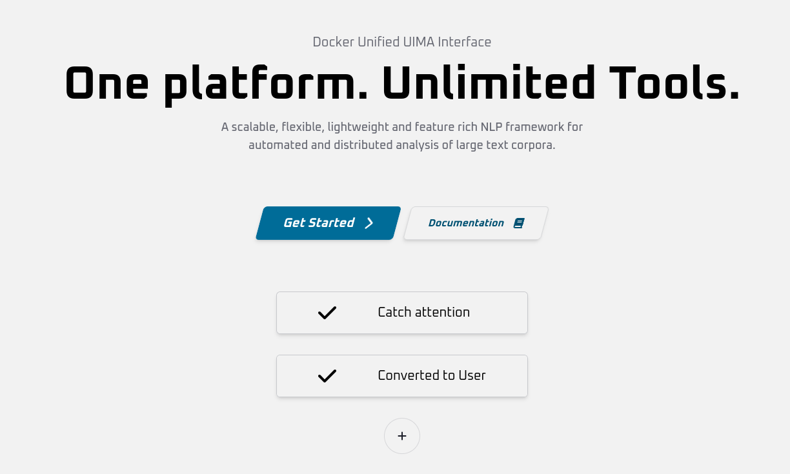

# Features

**DUUIGateway** includes a range of features which facilitate its effective and easy use of DUUI in various contexts and application areas.

## User management

**DUUIGateway** has a relatively straightforward user management system in which a distinction is maintained between the roles of **user** and **admin**. At the same time, groups can be created and users can be assigned to them.

* Role **user**: Users can use all functions of DUUIGateway to construct pipelines, create connectors and execute processes. The available resources in the cluster, as well as all other system parameters, are configured by the **admins**.
* Role **admin**: Administrators also have the ability to make global settings, manage groups as well as assign users to groups.

## Web and REST interface

The web interface and the REST API are the core components of DUUI Gateway.
Both features are interlinked and the web interface provides a general and generic accessibility of DUUI Gateway, which can also be used via the API after sessions and user accounts have been created.

<figure>
  
  <figcaption>Extract from the REST API.</figcaption>
</figure>

Both interfaces allow pipelines to be created, managed, [DUUI components](https://github.com/texttechnologylab/duui-uima) to be added or modified and processes to be started or monitored.

### Client libraries

## Dynamic pipeline construction

<figure>
  
  <figcaption>In order to process texts, various pipelines can be created and assembled using DUUI components.
</figcaption>
</figure>

<figure>
  
  <figcaption>Pipelines can also be saved as templates for future use.
</figcaption>
</figure>

<figure>
  
  <figcaption>Once a pipeline has been created, these can be executed as processes, where the source and destination of the files which are to be processed can be selected from a set of existing connectors.
</figcaption>
</figure>

<figure>
  
  <figcaption>
    This involves selecting a folder in a Nextcloud instance added by the user via the browser and selecting further parameters for the selection.
    </figcaption>
</figure>

## Result and monitoring

After or during the execution of a pipeline, the process progress and its status can be visualized and queried. Processed documents can be selected and examined.

<figure>
  
  <figcaption>The progress of the individual processed documents is displayed and the results are also visualized by selecting a document.</figcaption>
</figure>

<figure>
  
  <figcaption>The results of the annotation are visualized at document level with highlighting based on the selected annotation class.</figcaption>
</figure>

<figure>
  
  <figcaption>At the same time, statistical information on all annotations in the respective document is also visualized graphically. </figcaption>
</figure>

### Notification

Due to the user-related processing of DUUI processes, processes can be monitored live and the owners of the processes are also informed of the result of the processing via e-mail via DUUI Gateway.

<figure>
  
  <figcaption>A Result email after processing a pipeline defined in DUUI Gateway. </figcaption>
</figure>

## Connectors
DUUIGateway is capable of connecting to various cloud-based systems listed below, which can be individually configured and connected by the user in order to read in corpora for processing or subsequently serialize them again.

* Google Drive
* Nextcloud
* Dropbox
* Amazon Simple Storage Service (Amazon S3)
  * _[minio](https://github.com/minio/minio)_ for personal use

<figure>
  
  <figcaption>Exemplary connection to a Nextcloud instance</figcaption>
</figure>

___

# Summary
All of these features can be used by anyone. DUUIGateway is freely available and can be easily instantiated via Docker. Instructions can be found under [Setup](setup.md).

If you use DUUI Gateway, refer to the specified [citation](publications.md).

[//]: # (#### Python-Example)

[//]: # ()
[//]: # ()
[//]: # (### Connectors)

[//]: # ()
[//]: # ()
[//]: # (#### Dropbox)

[//]: # ()
[//]: # ()
[//]: # (#### Nextcloud)

[//]: # ()
[//]: # ()
[//]: # (#### GoogleDrive)

[//]: # ()
[//]: # ()
[//]: # ()
[//]: # (## Pipeline)

[//]: # ()
[//]: # (A pipeline is a collection of components or Analysis Engines that can be executed. During an analysis process, the components in the pipeline are executed one after)

[//]: # (another annotating documents. Pipelines do not interact with the input data directly but build the structure for an NLP workflow.)

[//]: # ()
[//]: # (Creating a pipeline with this web-interface can be done in the Builder. It is a three-step form that guides you through building a pipeline either from scratch or)

[//]: # (using a template as the starting point.)

[//]: # ()
[//]: # (>Choosing a template as a starting point copies all predefined settings into a fresh)

[//]: # (pipeline.)

[//]: # ()
[//]: # (In the second step pipeline specific properties like name, description, tags and settings can be edited.)

[//]: # (Only a name is required to proceed but adding a short description is recommended to serve as documentation)

[//]: # (and help others when sharing a pipeline. Tags can help document and find pipelines)

[//]: # (in the Dashboard.)

[//]: # ()
[//]: # (## Component)

[//]: # ()
[//]: # (Components are the part of DUUI that actually do the processing and therefore offer)

[//]: # (the most settings. When creating a pipeline you can choose from a set of predefined)

[//]: # (components or create your own. Once added to the pipeline, a component can be edited)

[//]: # (by clicking the  icon. This will open a drawer on)

[//]: # (the right, that allows for modification of a component.)

[//]: # ()
[//]: # (Settings include:)

[//]: # ()
[//]: # (**Name**)

[//]: # ()
[//]: # (**Driver** &mdash; The Driver is responsible for the instantiation)

[//]: # (of a component during a process.)

[//]: # ()
[//]: # (**Target** &mdash; The component's target depends on the selected)

[//]: # (driver. For Docker, Kubernetes and Swarm Drivers, the target is the full image name.)

[//]: # (For UIMA it is the class path to the Annotator represented by this component and for)

[//]: # (a Remote Driver the URL has to be specified.)

[//]: # ()
[//]: # (**Tags**)

[//]: # ()
[//]: # (**Description**)

[//]: # ()
[//]: # (**Options**)

[//]: # ()
[//]: # (**Parameters**)

[//]: # ()
[//]: # (Options are specific to the selected driver. Most of the time the default options)

[//]: # (are sufficient and modifications are only for special uses cases. Parameters are)

[//]: # (useful if the component requires settings that are not controlled by DUUI.)

[//]: # ()
[//]: # (>When editing a specific pipeline, clicking the  icon)

[//]: # (clones the component's settings and prefills the creation form.)

[//]: # ()
[//]: # (## Process)

[//]: # ()
[//]: # (A process manages the flow of data and pipeline execution. Starting a process is)

[//]: # (possible on a pipeline page. On the process creation screen you are asked to select)

[//]: # (an input, output and optionally settings that influence the process behavior.)

[//]: # ()
[//]: # (### Input and Output)

[//]: # ()
[//]: # (Any process must be provided with an input source to be started. Each requires)

[//]: # (different properties to be set. The available input sources are:)

[//]: # ()
[//]: # (#### Text)

[//]: # ()
[//]: # (For simple and quick analysis you can choose to process plain text. The text)

[//]: # (to be analyzed can be entered in a text area.)

[//]: # ()
[//]: # (#### File)

[//]: # ()
[//]: # (Selecting file as the input source allows for the upload of one or multiple)

[//]: # (files.)

[//]: # ()
[//]: # (#### Cloud)

[//]: # ()
[//]: # (There are currently four cloud storage providers available to use: Dropbox and)

[//]: # (Min.io &#40;s3&#41;, Google Drive, and NextCloud. More will be added in the future. To use your cloud storage)

[//]: # (provider of choice, a connection must be established on your Account page.)

[//]: # ()
[//]: # (>With the exception of text, all input sources require a file extension to be)

[//]: # (selected.)

[//]: # ()
[//]: # (### Settings)

[//]: # ()
[//]: # (Settings can be changed for both the input and output. Their main purpose is to)

[//]: # (filter the files that are processed. This can be done by setting a minimum file)

[//]: # (size or ignoring files that may be at the output location.)

[//]: # ()
[//]: # (Process related settings include the option to use multiple workers for parallel)

[//]: # (processing or ignoring errors that occur by skipping to next docment instead of)

[//]: # (failing the entire pipeline.)

[//]: # ()
[//]: # (Note that the amount of workers or threads that can be used is limited by the)

[//]: # (system!)

